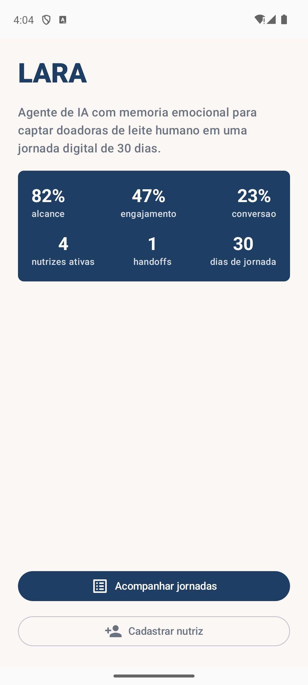
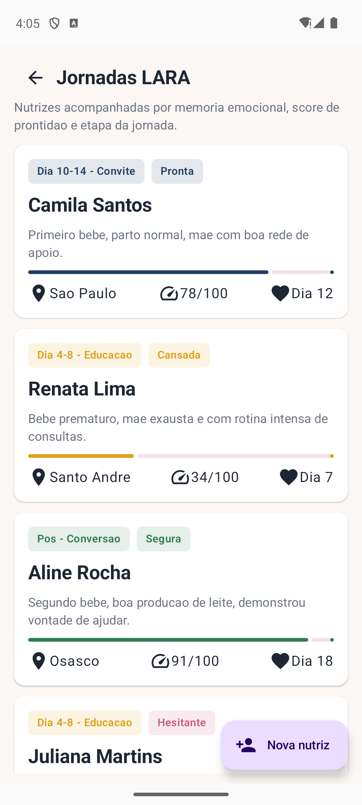
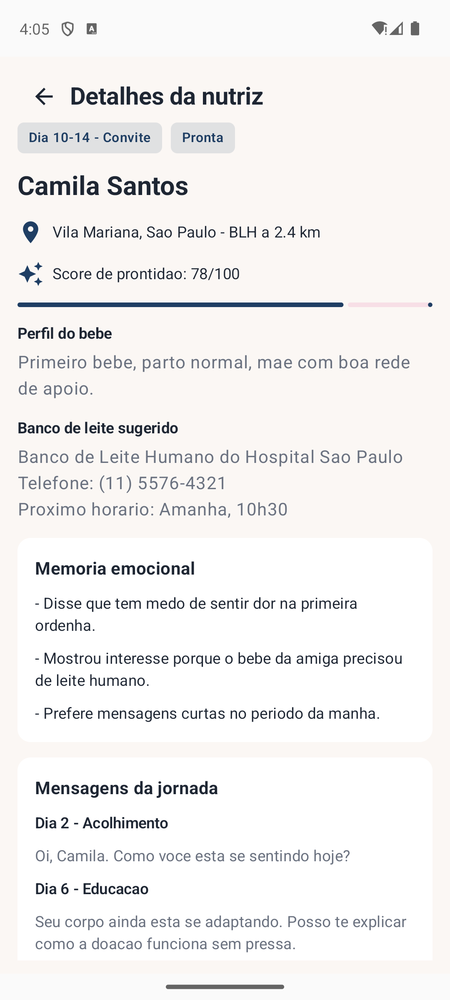
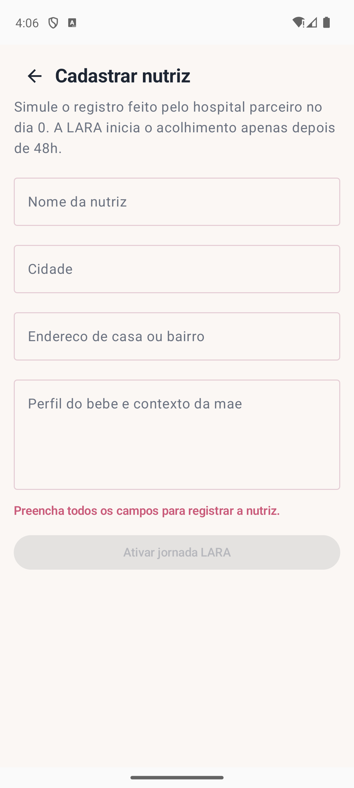
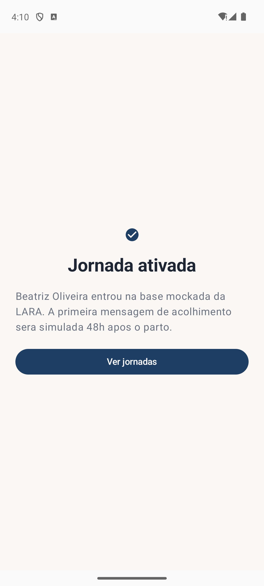

# LARA

## Identificacao

- **Nome do projeto:** LARA
- **Nome da equipe:** Equipe LARA
- **Integrantes e RM:**
  - Julia Sawaia - RM555438
  - Maria Eduarda Oliveira - RM558970
  - Guilherme Garcia - RM558102
  - Andre Pilatis - RM5558897
- **Repositorio GitHub:** https://github.com/juhsawaya/SPRINT-KOTLIN

## Objetivo do aplicativo

O LARA e um MVP Android em Kotlin baseado no pitch "Agente de IA com Memoria Emocional para Captacao de Doadoras de Leite Humano", do Challenge FIAP 2026 com Eurofarma, Desafio 1: Conecta BLH / Projeto Lactare.

A proposta resolve tres gargalos dos Bancos de Leite Humano: alcance, engajamento e conversao. O aplicativo simula uma jornada digital de 30 dias em que nutrizes sao acompanhadas por uma IA empatica, com score de prontidao, memoria emocional, sugestao do BLH mais proximo de casa e handoff humano quando ha baixa prontidao.

## Problema e publico-alvo

Os Bancos de Leite Humano brasileiros possuem grande relevancia social, mas operam com estoque abaixo do ideal. Muitas nutrizes nao sabem que podem doar, recebem informacao no momento errado ou desistem antes de concluir o cadastro.

O publico-alvo do MVP sao equipes da Lactare, Eurofarma, hospitais parceiros e Bancos de Leite Humano que precisam acompanhar nutrizes no pos-parto com comunicacao cuidadosa, personalizada e rastreavel.

## Funcionalidades implementadas

- Painel inicial com KPIs mockados do pitch: alcance, engajamento, conversao, nutrizes ativas e handoffs.
- Lista dinamica de nutrizes acompanhadas pela LARA.
- Tela de detalhes aberta pelo ID da nutriz selecionada.
- Exibicao de memoria emocional, etapa da jornada, sentimento, score de prontidao e mensagens simuladas.
- Sugestao do Banco de Leite Humano mais proximo da casa da nutriz.
- Acao simulada de convite para BLH quando o score esta alto.
- Acao simulada de handoff humano quando o score esta baixo.
- Cadastro de nova nutriz pelo fluxo do hospital parceiro no dia 0.
- Inclusao da nova nutriz na lista durante a navegacao usando estado em memoria.
- Tela de confirmacao apos ativar a jornada.

## Justificativa da priorizacao

Foram priorizados os fluxos centrais do pitch: visualizar funil, acompanhar nutrizes, consultar memoria emocional, decidir entre convite ou apoio humano e cadastrar uma nova jornada. Esses fluxos demonstram o valor principal da LARA sem depender de API, WhatsApp real, Firebase, banco local, Google Maps ou backend, conforme permitido nesta Sprint.

## Dados mockados

Os dados simulados estao organizados em `app/src/main/java/com/fiap/lara/data/MockLaraData.kt`. O arquivo usa os modelos `NutrizJourney`, `MilkBank`, `LaraMessage` e `NutrizForm`.

Cada nutriz possui nome, cidade, endereco de casa, perfil do bebe, dia pos-parto, etapa da jornada, score de prontidao, sentimento, BLH sugerido, memoria emocional, mensagens e indicacao de handoff humano.

Exemplos de casos usados:

- Nutriz com score 78, pronta para receber convite de doacao.
- Nutriz cansada no dia 7, ainda em etapa educativa.
- Nutriz convertida com agendamento no BLH mais proximo.
- Nutriz com score 18, recomendando handoff humano com contexto.

## Telas implementadas

### Painel inicial

Apresenta a marca LARA, resumo da proposta e KPIs principais do funil.



### Jornadas LARA

Lista nutrizes ativas com etapa da jornada, sentimento, perfil do bebe, cidade, dia pos-parto e score.



### Detalhes da nutriz

Mostra memoria emocional, mensagens da jornada, score, sentimento e BLH mais proximo da casa.



### Cadastrar nutriz

Formulario funcional que simula o registro feito pelo hospital parceiro no dia 0.



### Confirmacao

Retorno visual apos ativar a jornada mockada.



As imagens acima foram capturadas com o aplicativo rodando em emulador Android.

## Tecnologias utilizadas

- Kotlin
- Android SDK 36
- Jetpack Compose
- Material 3
- Navigation Compose
- Gradle Kotlin DSL
- Dados mockados em memoria

## Observacao sobre os dados

Todos os dados ficam em memoria usando estado do Jetpack Compose. Isso permite demonstrar cadastro, convite e handoff durante a navegacao, mas as alteracoes podem ser reiniciadas ao fechar o aplicativo.

Nesta Sprint nao foram implementados API, WhatsApp real, IA real, Firebase, banco local, Google Maps ou backend.

## Como executar

1. Abra a pasta do projeto no Android Studio.
2. Aguarde a sincronizacao do Gradle.
3. Confira se o modulo selecionado e `app`.
4. Selecione um emulador Android ou dispositivo fisico.
5. Clique em Run para executar.

Tambem e possivel compilar pelo terminal:

```bash
/Users/juliasawaia/.gradle/wrapper/dists/gradle-9.3.1-bin/23ovyewtku6u96viwx3xl3oks/gradle-9.3.1/bin/gradle assembleDebug
```

## Ambiente verificado

- JDK usado nesta maquina: OpenJDK 25.0.2
- Android Studio verificado nesta maquina: 2025.3
- Build testado: `assembleDebug`
- Emulador usado para os prints: Pixel_7

## Como explicar o codigo na apresentacao

- `MainActivity.kt`: ponto de entrada do app. Ela aplica o tema e chama a navegacao.
- `navigation/LaraNavHost.kt`: controla as rotas, guarda a lista em memoria e simula cadastro, convite e handoff.
- `model/`: define os dados do app, como nutriz, mensagem, banco de leite, sentimento e etapa da jornada.
- `data/MockLaraData.kt`: concentra os dados simulados usados na demonstracao.
- `ui/screens/`: contem as telas do app.
- `ui/components/`: contem componentes reutilizaveis, como cards e chips de status.
- `ui/theme/`: define cores e estilo visual inspirado no pitch.

## Checklist da Sprint 3

- [x] Projeto Android nativo em Kotlin.
- [x] Jetpack Compose, Material 3 e Navigation Compose.
- [x] Painel inicial, listagem, detalhes, formulario e confirmacao.
- [x] Navegacao funcional com passagem de parametro para detalhes.
- [x] Dados mockados organizados em arquivo separado.
- [x] Estado em memoria para incluir nova nutriz e simular acoes.
- [x] README na raiz com objetivo, funcionalidades e execucao.
- [x] Proposta alinhada ao pitch correto da LARA.
- [x] Versao do Android Studio informada no README.
- [x] Prints reais do app rodando salvos em `docs/screenshots/`.
